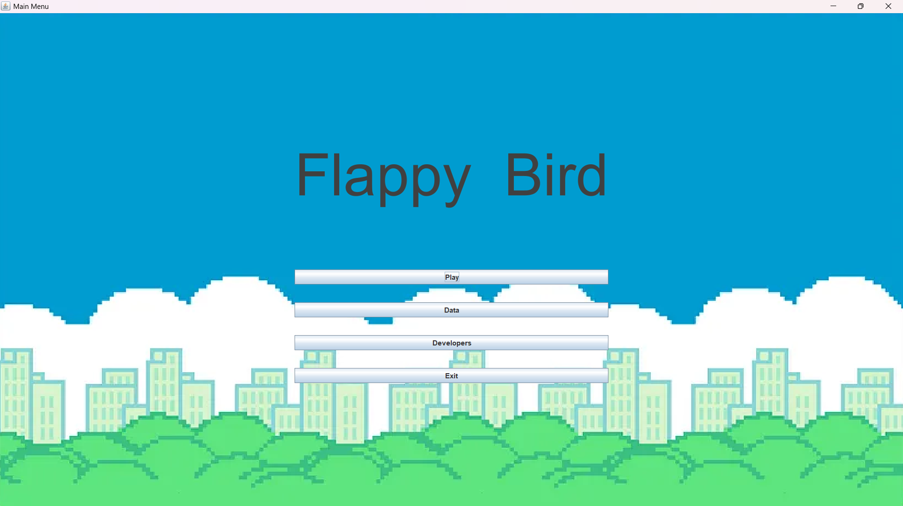
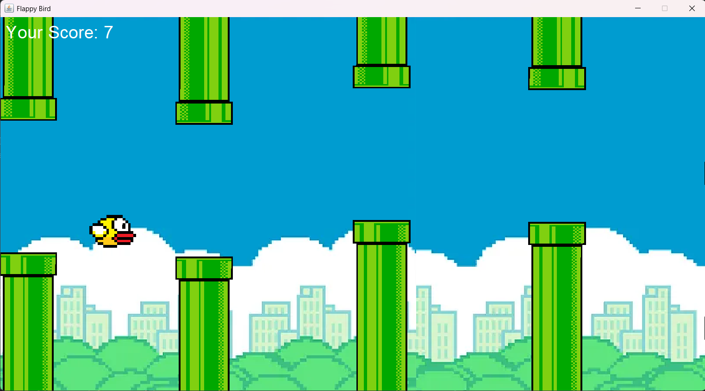
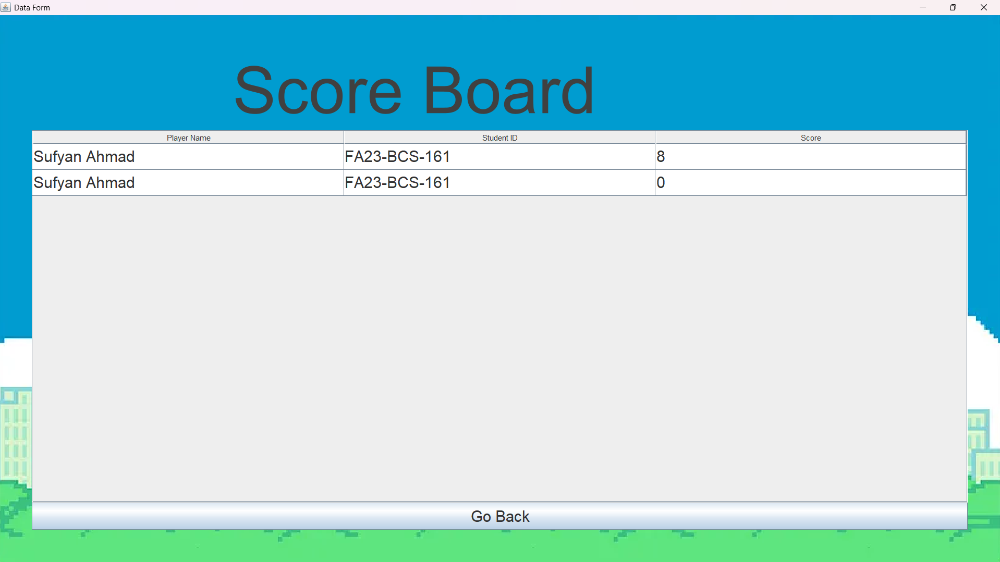

# 🐦 Flappy Bird — Java OOP Project

A fully playable **Flappy Bird** clone built in Java using **Swing** and **OOP principles** as a university project. Features animated pipes, gravity-based bird physics, a scoring system with persistent high-score tracking, and multiple game screens.

---

## 📸 Screenshots

### Main Menu


### Gameplay


### Game Over


### Scoreboard


### Info / About Form


---

## 🛠 Tech Stack

| Component     | Technology                          |
|---------------|-------------------------------------|
| Language      | Java                                |
| UI Framework  | Java Swing (`JPanel`, `JFrame`)     |
| Concurrency   | Java Threads (`Runnable`)           |
| Build Output  | `FlappyBird.jar` (runnable)         |
| IDE           | IntelliJ IDEA                       |

---

## 🧠 OOP Concepts Used

### Abstraction
`Moveable` is an abstract class that defines the contract for all moving game objects (`run()`, `start()`, `move()`). It also implements `Runnable` for threading.

### Inheritance
- `BirdMovement extends Moveable` — handles bird gravity and flap physics.
- `PipesMovement extends Moveable` — handles pipe spawning and leftward scroll.
- `BackgroundMovement extends Moveable` — handles parallax background scroll.
- `FlappyBird extends GameObjects` — the bird entity.
- `TopPipe`, `BottomPipe extends GameObjects` — pipe entities.

### Interface
- `Coordinates` — defines all shared game constants: window size, speeds, positions.

### Encapsulation
Each game entity manages its own state (`move`, `moveCounter`, `shouldTerminate`) and exposes controlled methods only.

### Threading
Each moving element (bird, pipes, background) runs on its own `Thread`, synchronised via the shared `volatile boolean shouldTerminate` flag for clean game-over handling.

---

## 📁 File Hierarchy

```
Flappy Bird Game/
│
├── src/                        # Java source files
│   ├── Main.java               # Entry point — launches InfoForm
│   ├── Moveable.java           # Abstract base class + BirdMovement, PipesMovement, BackgroundMovement
│   ├── GameObjects.java        # Base class for all renderable entities
│   ├── Coordinates.java        # Interface — all game constants (window size, speeds, positions)
│   ├── FlappyBird.java         # Bird entity (extends GameObjects)
│   ├── TopPipe.java            # Top pipe entity
│   ├── BottomPipe.java         # Bottom pipe entity
│   ├── Background.java         # Background renderer
│   ├── GamePanel.java          # Main game canvas — composes all game objects
│   ├── GameWindow.java         # JFrame wrapper
│   ├── MainMenu.java           # Main menu screen with buttons
│   ├── InfoForm.java           # Player info entry screen (first screen)
│   ├── DataForm.java           # Score data form / leaderboard input
│   ├── EndingScreen.java       # Game over screen with score display
│   └── OwnersForm.java         # Project members / credits screen
│
├── assets/
│   ├── Background.png          # Scrolling background image
│   ├── flappybird.png          # Bird sprite
│   ├── toppipe.png             # Top pipe sprite
│   ├── bottompipe.png          # Bottom pipe sprite
│   ├── data.txt                # Persistent high-score storage
│   └── cropped_Waqas Ul Hasan.png  # Custom player image
│
├── out/
│   ├── FlappyBird.jar          # Compiled runnable JAR
│   └── production/             # Compiled .class files
│
├── Members.txt                 # Team members list
└── screenshots/
```

---

## 🎮 Game Flow

```
InfoForm (enter name)
    ↓
MainMenu (Play / Scoreboard / Info / Owners)
    ↓
GamePanel (gameplay — bird + pipes + background all threaded)
    ↓
EndingScreen (score display)
    ↓
DataForm (save score to data.txt)
    ↓
Back to MainMenu
```

---

## ⚙️ How to Run

### Option A — Run the JAR directly
```bash
java -jar "out/FlappyBird.jar"
```

### Option B — Compile and run from source
```bash
javac -d out/production src/*.java
java -cp out/production Main
```

> Requires Java 8 or higher.
